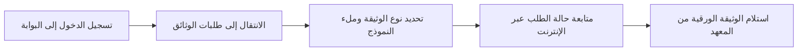

## نظرة عامة

يتولى المكتب الإداري معالجة جميع طلبات الوثائق والشهادات للطلاب الحاليين والسابقين.

لضمان التنظيم وتسهيل الخدمة، نطلب من الطلاب تقديم جميع الطلبات عبر الإنترنت من خلال [بوابة الطالب](https://app.essal.institute) لمعالجتها بشكل أسرع.

---

## سير العمل لطلب الوثائق عبر الإنترنت

لطلب أي وثيقة إدارية، يرجى اتباع الخطوات البسيطة التالية:

---

## 1. الشهادات المدرسية (Certificats de Scolarité)

شهادة تثبت تسجيلك الحالي في معهد إيصال.

* **الأهلية:** متاحة لجميع الطلاب المسجلين بالكامل والذين دفعوا القسط الأول من الرسوم الدراسية.
* **إجراءات الطلب:** قم بتسجيل الدخول إلى [بوابة الطالب](https://app.essal.institute)، وانتقل إلى قسم **طلبات الوثائق**، ثم اختر **شهادة مدرسية (Certificat de Scolarité)**، واضغط على **إرسال**.
* **مدة المعالجة:** من 24 إلى 48 ساعة عمل.
* **الاستلام:** يجب استلام الوثيقة شخصياً من المكتب الإداري بالمعهد. ستتلقى بريداً إلكترونياً وتنبيهاً على البوابة بمجرد توقيعها وتجهيزها.

---

## 2. كشوف النقاط الأكاديمية (Relevés de Notes)

سجلات رسمية لعلاماتك ومعدلات المقاييس.

* **الأهلية:** تصدر في نهاية كل سداسي أو عند الانتهاء من مسار تكوين كامل للحصول على شهادة.
* **إجراءات الطلب:** قم بتسجيل الدخول إلى [بوابة الطالب](https://app.essal.institute)، وانتقل إلى قسم **طلبات الوثائق**، ثم اختر **كشف النقاط (Relevé de Notes)**، وحدد السداسي المطلوب.
* **مدة المعالجة:** من 3 إلى 5 أيام عمل.

---

## 3. اتفاقيات التربص (Conventions de Stage)

اتفاقية رسمية ثلاثية الأطراف (بين الطالب، معهد إيصال، والمؤسسة المستضيفة) مطلوبة لبدء التربص التطبيقي في الجزائر.

* **الأهلية:** إلزامية لجميع طلاب دبلوم تقني سامي (TS) طويل المدى الذين يبدأون مشاريع التخرج الخاصة بهم.
* **إجراءات الطلب:**
  1. الحصول على عرض تربص من مؤسسة مستضيفة.
  2. تسجيل الدخول إلى [بوابة الطالب](https://app.essal.institute).
  3. الانتقال إلى قسم **التربصات ← طلب اتفاقية (Internships → Request Convention)**.
  4. ملء النموذج الإلكتروني بالاسم الرسمي للشركة، عنوانها، معلومات المؤطر، وتواريخ التربص.
  5. اضغط على **إرسال**.
  6. استلام ثلاث (3) نسخ من الاتفاقية موقعة ومختومة من مدير معهد إيصال من المكتب الإداري.
  7. اطلب من المؤسسة المستضيفة توقيع وختم جميع النسخ. احتفظ بنسخة لنفسك، وسلم نسخة للشركة، وقم برفع النسخة الثالثة الممسوحة ضوئياً إلى [بوابة الطالب](https://app.essal.institute).
* **مدة المعالجة:** 48 ساعة بعد تقديم النموذج.
