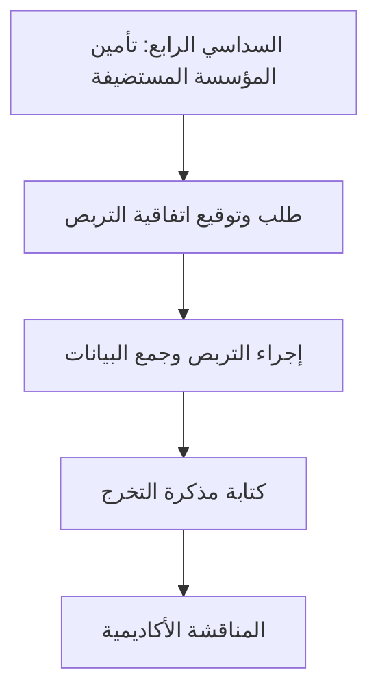

## التربصات التطبيقية الإلزامية للتخرج (Stage Pratique)

بالنسبة لجميع دبلومات تقني سامي (TS) المعتمدة من الدولة، يجب على الطلاب إكمال **تربص تطبيقي إلزامي لنهاية الدراسة** (Stage Pratique) تتراوح مدته بين **3 إلى 6 أشهر**.

ينتهي التربص بإعداد مذكرة نهاية الدراسة (Mémoire de fin d'études) ومناقشة شفهية (Soutenance) أمام لجنة تحكيم أكاديمية.

---

## الجدول الزمني لمراحل التربص

1. **البحث عن شركة (بداية السداسي الرابع):** ابحث عن مؤسسة مستضيفة في مجال دراستك (تطوير البرمجيات، الإدارة، التسويق).
2. **الموافقة على الاتفاقية:** قدم تفاصيل الشركة عبر الإنترنت من خلال [بوابة الطالب](https://app.essal.institute) لإصدار الاتفاقية.
3. **العمل الميداني:** العمل في مقر الشركة تحت إشراف مؤطر من الشركة ومؤطر أكاديمي من معهد إيصال.
4. **مرحلة الكتابة:** قم بتوثيق مشاريعك، دراسات الحالة، أو الأنظمة التي قمت بإعدادها في مذكرة التخرج.
5. **المناقشة:** تقديم وعرض عملك أمام اللجنة الأكاديمية لمعهد إيصال.

---

## إرشادات تنسيق مذكرة التخرج

يجب تقديم جميع المذكرات على [بوابة الطالب](https://app.essal.institute) بصيغة PDF وتجليدها ورقياً وفقاً للقواعد التالية:

* **عدد الصفحات:** من 40 إلى 60 صفحة (باستثناء الملاحق والمراجع).
* **الخط والحجم:** Arial أو Times New Roman، بحجم 12، وتباعد أسطر 1.5.
* **الهيكل:**
  - **صفحة الغلاف:** يجب أن تتبع القالب الرسمي للمعهد (قابل للتنزيل من [بوابة الطالب](https://app.essal.institute)).
  - **الإهداء والتشكرات**
  - **فهرس المحتويات وقائمة الأشكال**
  - **المقدمة:** السياق العام والأهداف.
  - **الجانب النظري:** استعراض المفاهيم، الأدوات، أو الدراسات السابقة.
  - **الجانب التطبيقي:** تفاصيل الإعداد والتنفيذ (مثل مخطط قاعدة البيانات، الأكواد البرمجية، خطط التسويق).
  - **الخاتمة والتوصيات**
  - **قائمة المراجع والمواقع الإلكترونية**

---

## هيكل المناقشة الشفهية (Soutenance)

بمجرد موافقة المؤطر الأكاديمي على النسخة النهائية، يتم جدولة موعد مناقشة شفهية للطالب:

- **المدة:** 30 دقيقة إجمالاً.
  - **العرض (20 دقيقة):** عرض شرائح يلخص الإنجازات الرئيسية للمشروع والنتائج.
  - **جلسة الأسئلة والأجوبة (10 دقائق):** الإجابة على أسئلة لجنة التحكيم (المكونة من المؤطر وممتحنين اثنين).
- **التقييم:** تُنقط المناقشة من 20. وتحتسب هذه العلامة ضمن معدل التخرج النهائي.

---

## خدمات التطوير والتوجيه المهني

نحن نقدم الموارد اللازمة لمساعدة الطلاب في الانتقال إلى سوق العمل المهني:

* **ورش عمل كتابة السيرة الذاتية (CV):** حصص مخصصة لصياغة سير ذاتية احترافية تتناسب مع سوق العمل الجزائري والدولي.
* **المقابلات التجريبية:** حصص تدريبية عملية للمقابلات تجرى مع أساتذة ذوي خبرة.
* **أيام التوظيف (أيام قطاع العمل):** فعاليات توظيف سنوية تقام في المعهد بوهران، تجمع بين وكالات تكنولوجيا المعلومات المحلية والبنوك وشركات الاتصالات.

---

## شبكة الشركاء المحليين

يحتفظ معهد إيصال بعلاقات متينة مع كبار أرباب العمل في وهران والجزائر العاصمة لتسهيل توظيف الطلاب:

- **الشركات التكنولوجية الناشئة:** فرص في تصميم البرمجيات، التسويق الرقمي، وتحليلات الويب.
- **الاتصالات ومزودو خدمة الإنترنت:** فرص في عمليات الشبكات، إدارة الأنظمة، وكابلات البنية التحتية.
- **مكاتب الاستشارات والمحاسبة:** فرص لطلاب المحاسبة، الإدارة، وتسيير الموارد البشرية.
- **المؤسسات الصناعية:** إدارة العمليات ودعم البنية التحتية لتكنولوجيا المعلومات في المناطق الصناعية بوهران.
