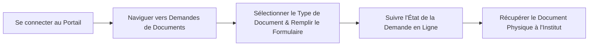

## Aperçu

Le bureau administratif s'occupe de toutes les demandes de documents et de certifications pour les étudiants actuels et anciens.

Afin de maintenir une bonne organisation, nous demandons aux étudiants de soumettre toutes leurs demandes en ligne via le [Portail Étudiant](https://app.essal.institute) pour un traitement plus rapide.

---

## Flux de Demande de Documents en Ligne

Pour demander tout document administratif, suivez ce processus simple :

---

## 1. Certificats de Scolarité

Un certificat prouvant votre inscription active à l'Institut Essal.

* **Éligibilité :** Disponible pour tous les étudiants entièrement inscrits ayant réglé leur première tranche d'inscription.
* **Procédure de Demande :** Connectez-vous au [Portail Étudiant](https://app.essal.institute), naviguez vers **Demandes de Documents**, sélectionnez **Certificat de Scolarité**, puis cliquez sur **Soumettre**.
* **Délai de Traitement :** 24 à 48 heures ouvrables.
* **Retrait :** Doit être récupéré en personne auprès du secrétariat administratif de l'Institut. Vous recevrez un e-mail de notification et une alerte sur le portail lorsque le document sera signé et prêt.

---

## 2. Relevés de Notes Académiques

Documents officiels indiquant vos notes et moyennes de modules.

* **Éligibilité :** Délivré à la fin de chaque semestre ou après l'achèvement d'un cycle complet de formation.
* **Procédure de Demande :** Connectez-vous au [Portail Étudiant](https://app.essal.institute), naviguez vers **Demandes de Documents**, sélectionnez **Relevé de Notes**, puis choisissez le semestre concerné.
* **Délai de Traitement :** 3 à 5 jours ouvrables.

---

## 3. Conventions de Stage

Accord officiel tripartite (entre l'étudiant, l'Institut Essal et l'entreprise d'accueil) requis pour tout stage pratique en Algérie.

* **Éligibilité :** Obligatoire pour tous les étudiants en formation à long terme de type TS (Technicien Supérieur) débutant leur projet de fin d'études.
* **Procédure de Demande :**
  1. Obtenez une offre de stage auprès d'une entreprise d'accueil.
  2. Connectez-vous au [Portail Étudiant](https://app.essal.institute).
  3. Naviguez vers **Stages → Demander une Convention**.
  4. Remplissez le formulaire en ligne avec la raison sociale de l'entreprise, son adresse, les coordonnées du tuteur de stage et les dates du stage.
  5. Cliquez sur **Soumettre**.
  6. Récupérez trois (3) exemplaires de la convention signés et tamponnés par le directeur d'Essal auprès du secrétariat administratif.
  7. Faites signer et tamponner tous les exemplaires par l'entreprise d'accueil. Conservez un exemplaire pour vous, remettez-en un à l'entreprise et téléversez la version scannée du troisième exemplaire sur le [Portail Étudiant](https://app.essal.institute).
* **Délai de Traitement :** 48 heures après la soumission du formulaire.
