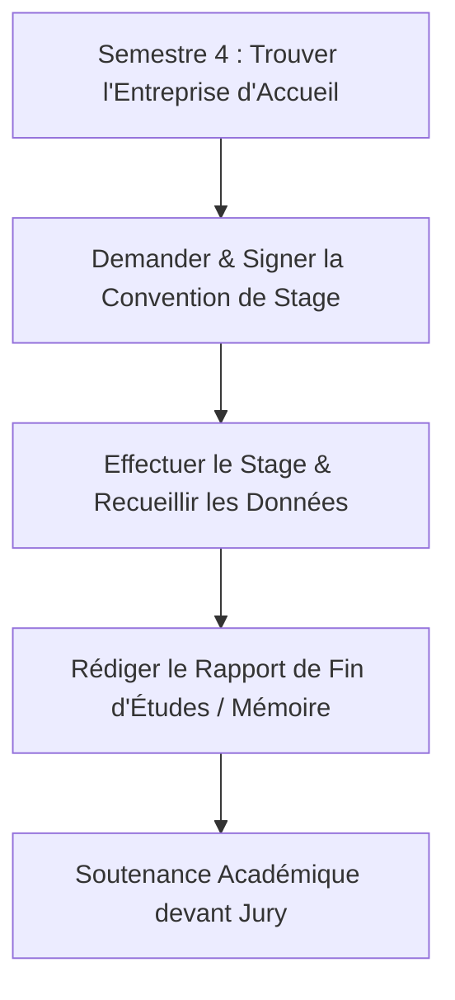

## Stages Pratiques Obligatoires de Fin d'Études

Pour tous les diplômes de Technicien Supérieur (TS) agréés par l'État, les étudiants doivent effectuer un **stage obligatoire de fin d'études** d'une durée comprise entre **3 et 6 mois**.

Le stage se termine par la rédaction d'un mémoire de fin d'études et une soutenance orale devant un jury académique.

---

## Calendrier des Étapes du Stage

1. **Recherche de l'Entreprise (Début S4) :** Recherchez une entreprise d'accueil dans votre domaine d'études (développement informatique, administration, marketing).
2. **Validation de la Convention :** Soumettez les détails en ligne via le [Portail Étudiant](https://app.essal.institute) pour l'établissement de votre convention.
3. **Déroulement :** Travaillez sur site sous la direction d'un tuteur en entreprise et d'un encadrant pédagogique d'Essal.
4. **Phase de Rédaction :** Documentez vos projets, études de cas ou implémentations de systèmes dans votre mémoire de fin d'études.
5. **Soutenance :** Présentez vos travaux devant le comité académique d'Essal.

---

## Consignes de Mise en Page du Mémoire de Fin d'Études

Tous les mémoires doivent être déposés sur le [Portail Étudiant](https://app.essal.institute) au format PDF et reliés physiquement selon les règles suivantes :

* **Nombre de Pages :** 40 à 60 pages (hors annexes et bibliographie).
* **Police & Taille :** Arial ou Times New Roman, taille 12pt, interligne 1,5.
* **Structure :**
  - **Page de Garde :** Doit respecter le modèle officiel d'Essal (téléchargeable sur le [Portail Étudiant](https://app.essal.institute)).
  - **Dédicaces & Remerciements**
  - **Table des Matières & Liste des Figures**
  - **Introduction :** Contexte général et objectifs.
  - **Chapitre Théorique :** Revue des concepts, outils ou littérature.
  - **Chapitre Pratique :** Implémentation détaillée (ex. schéma de base de données, blocs de code source, plans marketing).
  - **Conclusion & Recommandations**
  - **Bibliographie & Webographie**

---

## Déroulement de la Soutenance Orale

Une fois que l'encadrant pédagogique a approuvé la version finale du document, l'étudiant est programmé pour une soutenance orale :

- **Durée :** 30 minutes au total.
  - **Présentation (20 min) :** Présentation PowerPoint résumant les principales réalisations et les résultats du projet.
  - **Session Q&R (10 min) :** Réponses aux questions du jury (composé de l'encadrant et de deux examinateurs).
- **Évaluation :** Note sur 20. Cette note compte dans la moyenne finale de fin d'études.

---

## Services d'Aide à l'Emploi

Nous mettons à disposition des ressources pour aider les étudiants à s'insérer sur le marché professionnel :

* **Ateliers CV & Lettre de Motivation :** Sessions axées sur la rédaction de CV professionnels adaptés aux marchés de l'emploi algérien et international.
* **Simulations d'Entretiens :** Exercices pratiques d'entretien d'embauche menés par des formateurs expérimentés.
* **Journées de Recrutement (Industry Days) :** Événements annuels de recrutement organisés au sein de l'Institut à Oran, réunissant des entreprises informatiques, des banques et des opérateurs de télécommunications locaux.

---

## Réseau de Partenaires Locaux

L'Institut Essal entretient des relations étroites avec des employeurs clés à Oran et Alger pour faciliter le placement des étudiants :

- **Startups Technologiques Locales :** Opportunités en conception logicielle, marketing digital et analyse web.
- **Opérateurs Télécoms & FAI :** Stages en gestion de réseaux, administration système et câblage d'infrastructures.
- **Cabinets de Comptabilité et de Conseil :** Stages pour les étudiants en comptabilité, administration et gestion des ressources humaines.
- **Entreprises Industrielles :** Gestion des opérations et support d'infrastructure informatique dans les zones industrielles d'Oran.
