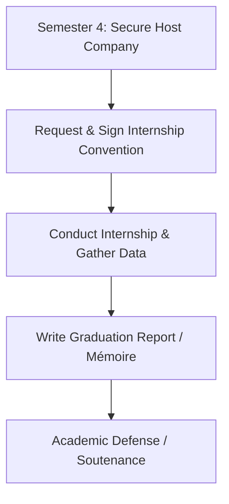

## Mandatory Graduation Internships (Stage Pratique)

For all government-accredited Technicien Supérieur (TS) diplomas, students must complete a **mandatory end-of-studies internship** (Stage Pratique) lasting between **3 to 6 months**.

The internship culminates in a graduation project report (Mémoire de fin d'études) and an oral defense (Soutenance) before an academic jury.

---

## Internship Process Timeline

1. **Company Search (S4 Start):** Search for a hosting firm in your area of study (IT development, administration, marketing).
2. **Convention Approval:** Submit details online via the [Student Portal](https://app.essal.institute) for convention issuance.
3. **Execution:** Work on-site under the guidance of a company tutor and an Essal academic advisor.
4. **Writing Phase:** Document your projects, case studies, or system implementations in the graduation report.
5. **Defense:** Present your work to the Essal academic committee.

---

## Graduation Report (Mémoire) Formatting Guidelines

All reports must be submitted on the [Student Portal](https://app.essal.institute) in PDF format and bound physically according to these rules:

* **Page Count:** 40 to 60 pages (excluding annexes and bibliography).
* **Font & Size:** Arial or Times New Roman, 12pt size, 1.5 line spacing.
* **Structure:**
  - **Cover Page:** Must follow the official Essal template (downloadable on the [Student Portal](https://app.essal.institute)).
  - **Dedications & Acknowledgements**
  - **Table of Contents & List of Figures**
  - **Introduction:** General context and objectives.
  - **Theoretical Chapter:** Review of concepts, tools, or literature.
  - **Practical Chapter:** Detailed implementation (e.g. database schema, source code blocks, marketing plans).
  - **Conclusion & Recommendations**
  - **Bibliography & Webography**

---

## Oral Defense (Soutenance) Structure

Once the academic advisor approves the final draft, the student is scheduled for an oral defense:

- **Duration:** 30 minutes total.
  - **Presentation (20 mins):** Slide presentation summarizing key project achievements and results.
  - **Q&A Session (10 mins):** Answering questions from the jury committee (comprising the advisor and two examiners).
- **Assessment:** Graded out of 20. This mark counts towards the final graduation average.

---

## Career Development Services

We offer resources to help students transition into the professional market:

* **Resume & CV Workshops:** Sessions focused on crafting professional resumes tailored to the Algerian and international job markets.
* **Mock Interviews:** Practical interview practice sessions conducted with experienced instructors.
* **Industry Days:** Yearly recruitment events hosted at the Institute in Oran, bringing together local IT agencies, banks, and telecom firms.

---

## Local Partner Network

Essal Institute maintains relationships with key employers in Oran and Algiers to facilitate student placement:

- **Local Tech Startups:** Opportunities in software design, digital marketing, and web analytics.
- **Telecom & ISPs:** Placements in network operations, system administration, and infrastructure cabling.
- **Consulting & Accounting Firms:** Placements for accounting, administration, and HR management students.
- **Industrial Enterprises:** Operations management and IT infrastructure support in Oran's industrial zones.
